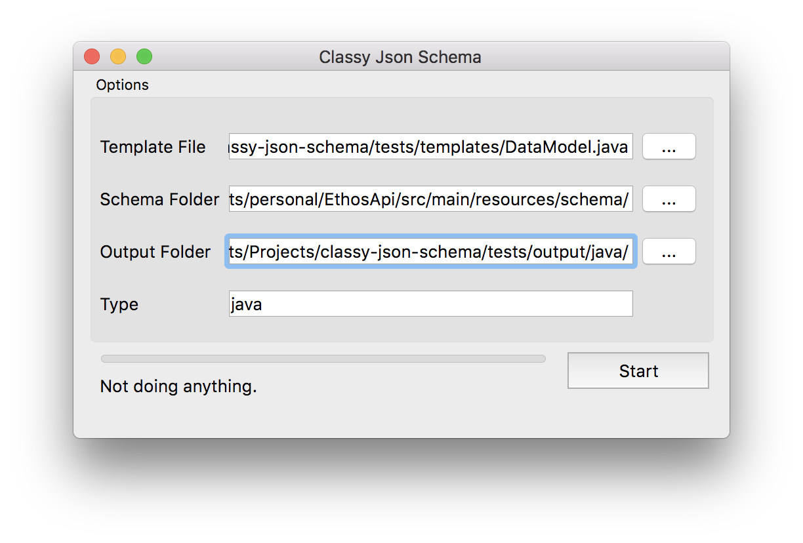

# Classy Json Schema

Generate PO&lt;T>O's for any language using a template file.



## Requirements
- Hunter


## Parameters
```
./classy_json_schema

--templateFile
"/path/to/classy-json-schema/tests/templates/DataModel.java"
--schemaFolder
"/path/to/schema/"
--outputFolder
"/path/to/classy-json-schema/tests/output/java/"
--outputType
"java"
--cli
```